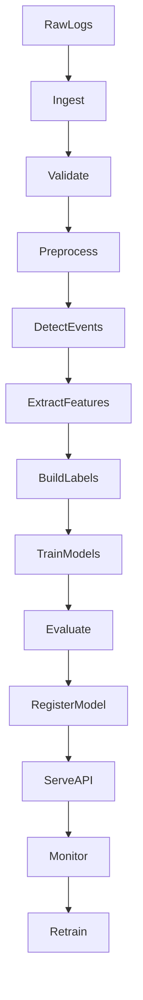

# Plan of Approach
## OBSeRVeD CMOS VOC Sensor - MLOps Pipeline Design

**Project:** OBSeRVeD - Odour Based Selective Recognition of Veterinary Diseases  
**Course:** DataOps / MLOps Project  
**Client:** Eyuel Ayele

---

# 1. Introduction

In this project, we design an end-to-end MLOps pipeline for CMOS VOC sensor data.

Our aim is to convert raw sensor time-series logs into reproducible, model-ready outputs for hierarchical gas analysis. The pipeline is planned as a full workflow, from ingestion and feature engineering to two-stage modeling, evaluation, and API serving.

Methodologically, the plan follows the CRISP-DM development cycle and extends it with MLOps practices for deployment, monitoring, and iterative improvement (Wirth & Hipp, 2000).

The core idea is simple:

- read and clean sensor logs
- generate robust time-series features
- train Stage 1 mixture detection and Stage 2 single-gas classification models
- evaluate with leakage-safe, group-aware validation (Roberts et al., 2017; Kaufman et al., 2012)
- serve predictions through an API
- keep data/model/artifact lineage reproducible

This is a master-level engineering design focused on reproducibility, clear structure, and practical implementation.

---

# 2. Data Overview

## 2.1 Available Sensor Data

The planned data flow is based on raw sensor runs under `data/raw`, transformed into canonical processed artifacts for model training and inference.

Primary processed artifacts will include:

- `processed_timeseries` (cleaned time-series representation)
- `runs` (run-level metadata)
- `windowed_timeseries` and train/test windows
- `features_timeseries` (engineered feature table)
- `features_single_gas` (filtered subset for Stage 2)

## 2.2 What This Data Supports

With this data type and labeling strategy, the primary outputs are:

- Stage 1 binary detection: `single_gas` vs `mixture`
- Stage 2 gas-type classification/probability on the single-gas route (Toluene vs 2-butanone)

Additional disease-level or broader multi-gas tasks can be added later when validated labels are extended.

This direction is aligned with prior work in electronic nose systems and machine olfaction for agricultural and environmental applications (Wilson & Baietto, 2009; Gutierrez-Osuna, 2002).

---

# 3. Project Goals

The pipeline is designed to meet the assignment goals below.

| Goal | Planned Result |
|---|---|
| Data ingestion | Parse raw sensor runs into canonical processed artifacts |
| Feature engineering | Build reproducible time-series features for hierarchical modeling |
| Stage 1 modeling | Train and compare mixture-detection candidates |
| Stage 2 modeling | Train/compare/tune single-gas classification candidates |
| Evaluation | Report stage-wise metrics (accuracy, precision, recall, F1, confusion matrix) |
| Reproducibility | Config-based runs, fixed seeds, pinned dependencies |
| Tracking | Log parameters, metrics, and artifacts |
| Versioning | Keep data-model-code lineage traceable |
| Orchestration | Run an end-to-end pipeline DAG |
| API deployment | Serve `/health`, `/model-info`, `/predict`, and `/predict-raw` endpoints |
| Monitoring | Track drift and support retraining triggers |

---

# 4. Scope

## 4.1 In Scope

The first full release will produce these outputs from one unified feature pipeline:

1. Stage 1 mixture detection (`single_gas` vs `mixture`)
2. Stage 2 single-gas type classification/probability (Toluene vs 2-butanone)
3. Batch prediction artifacts and stage-wise evaluation reports

## 4.2 Conditional Scope

4. Broader gas-class extension or disease proxy classification

This output will be included only when additional validated labels are available.

## 4.3 Out of Scope (First Release)

- clinical diagnosis claims
- full cloud production operation
- multi-farm fleet management
- regulatory certification

---

# 5. Data Schema

The system uses the five core tables required in the assignment.

## 5.1 Storage Plan

- `runs`, `events`, `features`, `labels` in Parquet
- `raw_frames` in HDF5 or Zarr (array-friendly)
- no CSV for the main ML pipeline storage

Why we chose this:

- Parquet is efficient for tabular analytics and model-ready feature tables.
- HDF5/Zarr is better for high-dimensional frame arrays (32 x 32 x time).
- CSV is avoided because it is weak for typed schemas and large multidimensional data.

## 5.2 Core Tables

| Table | Key Fields | Purpose | Storage |
|---|---|---|---|
| runs | run_id, sensor_id, start_time, sampling_rate_hz, duration_s, experiment_type, notes, data_version | Run metadata | Parquet |
| raw_frames | run_id, frame_id, timestamp, packet_id, layer_id, frame_32x32, layer_sum | Raw frame archive | HDF5/Zarr |
| events | event_id, run_id, t_start, t_end, event_type, confidence_score, gas_label, target_ppm | Event windows | Parquet |
| features | event_id, run_id, temporal/spatial/stability features | Model inputs | Parquet |
| labels | event_id, run_id, severity_label, concentration_label, gas_label, disease_label, sensor_health_label, label_provenance, is_synthetic | Supervision and provenance | Parquet |

## 5.3 Integrity Rules

- each run has one unique `run_id`
- each event maps to one `run_id`
- each feature record maps to one `event_id`
- each label includes provenance
- missing labels are stored explicitly

---

# 6. Data Quality and Preprocessing

The preprocessing design includes these steps:

1. parse raw logs into timestamped layered frames
2. validate frame completeness and pixel count
3. apply consistent spatial ordering
4. compute coated-reference signal
5. handle missing timestamps with clear policy
6. detect dead pixels and dead-pixel ratio
7. estimate baseline drift
8. generate run-level quality report

## 6.1 Leakage Rule

Train/test split is done by run, day, or sensor.

Random frame-level split is not allowed.

---

# 7. Project Structure

```text
OBSERVED_WP4_CMOS_DigitalTwinModel/
|-- src/
|   |-- observed/
|   |   |-- ingestion/
|   |   |-- preprocessing/
|   |   |-- event_detection/
|   |   |-- features/
|   |   |-- models/
|   |   |-- monitoring/
|   |   |-- utils/
|
|-- configs/
|   |-- default.yaml
|   |-- training.yaml
|   |-- inference.yaml
|
|-- pipelines/
|   |-- ingest_flow.py
|   |-- train_flow.py
|   |-- batch_predict_flow.py
|
|-- api/
|   |-- app.py
|   |-- schemas.py
|
|-- tests/
|   |-- test_ingestion.py
|   |-- test_event_detection.py
|   |-- test_features.py
|   |-- test_api.py
|   |-- test_pipeline_integration.py
|
|-- docker/
|   |-- Dockerfile
|   |-- docker-compose.yml
|
|-- data/
|   |-- interim/
|   |-- processed/
|   |-- synthetic/
|
|-- artifacts/
|   |-- models/
|   |-- reports/
|
|-- docs/
|   |-- schema.md
|   |-- architecture.md
|   |-- handover.md
```

---

# 8. Pipeline Flow

## 8.1 End-to-End Flow



## 8.2 Pipeline Stages

### Stage 1: Ingest
- load raw sensor logs
- register run metadata
- store canonical frame data

### Stage 2: Validate and Preprocess
- validate structure and time continuity
- compute baseline and drift indicators
- produce cleaned signal representation

### Stage 3: Detect Events
- detect event start and end
- mark recovery phase
- assign confidence score

### Stage 4: Extract Features
- generate temporal, spatial, and stability features

### Stage 5: Train and Compare
- train unsupervised model
- train classical ML model
- train deep learning model

### Stage 6: Evaluate and Register
- compare model performance
- log experiment results
- register selected model

### Stage 7: Serve and Monitor
- run API inference
- process incoming runs
- monitor drift and retraining trigger

## 8.3 Why This Stage Order

- Data validation comes early to prevent bad runs from entering training.
- Event detection comes before feature extraction so features are computed from meaningful windows.
- Evaluation comes before model registration to avoid promoting weak models.
- Monitoring comes after deployment to detect data or prediction drift in operation.

---

# 9. Tools and Reproducibility

## 9.1 Tool Choices

| Area | Tool | Why |
|---|---|---|
| Language | Python 3.11 | Strong ecosystem for scientific computing and ML workflows |
| Configs | YAML | Simple, readable, and easy for experiment configuration |
| Experiment tracking | Airflow | Scheduled and dependency-aware pipeline runs with clear DAG visibility and run history |
| Data versioning | DVC | Reproducible data lineage across experiments |
| Orchestration | Prefect | Clear flow-based scheduling with Python-native development |
| API | FastAPI | Lightweight and robust for serving ML predictions |
| Containerization | Docker | Reproducible runtime across machines |
| Testing | pytest | Standard testing framework for unit and integration tests |
| Logging | Structured JSON | Easier observability and machine-readable audit trails |

## 9.2 Reproducibility Rules

- fixed seeds for model and numerical runs
- config-based execution only
- no hardcoded local paths
- single command for train/inference pipeline

Example:

```bash
python -m pipelines.train_flow --config configs/training.yaml
```

---

# 10. Feature Plan

## 10.1 Temporal Features

- peak response (delta_max)
- area under curve (AUC)
- rise time
- recovery time
- time-to-peak
- slope measures
- event duration

## 10.2 Spatial Features

- map mean and variance
- hotspot measures
- spatial gradients
- pixel correlation summaries
- PCA components
- coated-reference contrast

## 10.3 Stability Features

- baseline noise
- drift slope
- dead pixel ratio
- layer consistency
- sensor health index
- calibration status

## 10.4 Feature Level

Features are generated mainly at event level, with selected run-level context.

---

# 11. Model Plan

At least three model families will be implemented.

## 11.1 Unsupervised

- Isolation Forest (Liu et al., 2008)
- target use: anomaly and sensor health detection
- why chosen: it works well when labels are limited and provides a strong anomaly baseline with low computational cost

## 11.2 Classical ML

- Random Forest (Breiman, 2001) and XGBoost (Chen & Guestrin, 2016)
- target use: severity class and concentration proxy
- why chosen: both models are robust on tabular engineered features and can capture nonlinear behavior

## 11.3 Deep Learning

- 1D CNN or TCN on event sequences (LeCun et al., 2015; Bai et al., 2018)
- target use: temporal pattern learning
- why chosen: temporal deep models can learn sequence dynamics that are hard to capture with handcrafted features only

## 11.4 Stretch Goal

- spatiotemporal CNN on 32 x 32 x time windows
- why chosen: this model can use full spatial-temporal structure, but needs more data and higher training cost

## 11.5 Model Selection Criteria

The final model is selected based on:

- performance on unseen runs
- robustness under drift/noise tests
- inference speed for operational use
- interpretability for reporting and decision support

---

# 12. Evaluation Plan

## 12.1 Generalization Protocol

- train on selected runs
- test on unseen runs
- report per run and per sensor

## 12.2 Metrics

| Task | Metrics |
|---|---|
| Event detection | precision, recall, delay, false alarms/hour |
| Classification | ROC-AUC, PR-AUC, F1, balanced accuracy, confusion matrix |
| Regression | MAE, RMSE, R2, calibration plot |
| Monitoring quality | drift scores, alert counts, latency |

## 12.3 Imbalance Handling

At least two of these will be used:

- class weighting
- threshold tuning with PR curve
- resampling or focal-loss style methods

We prioritize PR-based thresholding because PR curves are often more informative than ROC curves in imbalanced settings (Saito & Rehmsmeier, 2015).

## 12.4 Error Analysis

The report includes:

- confusion matrix by concentration range
- failure cases by run and sensor
- drift trend over time
- false positive and false negative analysis

## 12.5 Robustness Test

At least one controlled robustness scenario:

- baseline drift injection
- concentration schedule change
- noise injection
- environmental shift where metadata exists

---

# 13. Deployment and Monitoring

## 13.1 API Endpoints

- `POST /predict`: prediction from run chunk or event features
- `GET /health`: service status and uptime
- `GET /model-info`: model version and training metadata

Why these endpoints:

- `/predict` is the operational endpoint used by downstream applications.
- `/health` supports service monitoring and uptime checks.
- `/model-info` supports traceability, governance, and experiment reproducibility.

## 13.2 Container Run

```bash
docker build -t observed-api -f docker/Dockerfile .
docker run -p 8000:8000 observed-api
```

## 13.3 Scheduled Processing

Workflow will:

1. detect new run files
2. run inference
3. log outputs and drift indicators
4. trigger retraining when threshold or schedule condition is met

## 13.4 Monitoring

- data drift monitoring
- prediction drift monitoring
- API latency and reliability
- structured audit logs
- delayed performance checks after labels arrive

## 13.5 Model Governance

- model stages: staging and production
- promotion based on metric thresholds and integration checks
- rollback to recent stable model when needed

---

# 14. Synthetic Data Plan

Synthetic data is included for robustness and label scarcity.

## 14.1 Why We Need It

- limited disease labels
- need for controlled stress testing
- need to test behavior under drift and noise

## 14.2 Generator Controls

- peak amplitude
- rise and recovery shape
- baseline drift
- noise level
- dead pixel masks
- event duration and spacing

## 14.3 Use Cases

- event detector stress test
- class balancing
- drift robustness tests
- simulated labels with full provenance

All synthetic rows will include:

- `label_provenance = simulated`
- `is_synthetic = true`

---

# 15. Work Plan

## Phase 1: Requirements and Data Contracts

- finalize schema and metadata fields
- prepare config templates
- define reproducibility checklist

## Phase 2: Ingestion and Preprocessing

- implement parsing and storage flow
- run quality checks
- produce validated run artifacts

## Phase 3: Events and Features

- implement event segmentation
- build feature tables
- persist events and features

## Phase 4: Training and Evaluation

- train three model families
- evaluate generalization
- run error and robustness analyses

## Phase 5: MLOps Integration

- connect tracking and versioning
- implement orchestration
- deploy API and container image

## Phase 6: Monitoring and Finalization

- add drift and reliability monitoring
- connect retraining trigger logic
- finalize report, docs, and demo flow

---

# 16. Deliverables

| Deliverable | Evidence |
|---|---|
| Working pipeline | single-command end-to-end run |
| Technical report | schema, architecture, models, results, limits |
| Handover playbook | operation and extension guide |
| API + Docker demo | local run with sample request/response |
| Tracking evidence | logged runs, metrics, and artifacts |
| Live demo | new run to prediction and alert |

---

# 17. Completion Criteria

The project is complete when:

1. raw logs are ingested into the designed schema
2. events and features are generated automatically
3. three model families are trained and compared
4. evaluation uses run-level generalization and required metrics
5. data, experiments, and models are fully traceable
6. API service runs with predict, health, and model-info endpoints
7. containerized execution is reproducible
8. monitoring and retraining triggers are active
9. documentation is complete for handover

---

# 18. Conclusion

This plan defines a clear and practical MLOps pipeline for CMOS VOC sensor data at master level.

It combines data engineering, model development, deployment, and monitoring in one reproducible system design that can be implemented step by step.

---

# 19. References

- Bai, S., Kolter, J. Z., & Koltun, V. (2018). An empirical evaluation of generic convolutional and recurrent networks for sequence modeling.
- Breiman, L. (2001). Random forests. Machine Learning.
- Chen, T., & Guestrin, C. (2016). XGBoost: A scalable tree boosting system. KDD.
- Gutierrez-Osuna, R. (2002). Pattern analysis for machine olfaction: A review. IEEE Sensors Journal.
- LeCun, Y., Bengio, Y., & Hinton, G. (2015). Deep learning. Nature.
- Liu, F. T., Ting, K. M., & Zhou, Z.-H. (2008). Isolation Forest. ICDM.
- Saito, T., & Rehmsmeier, M. (2015). The precision-recall plot is more informative than the ROC plot when evaluating binary classifiers on imbalanced datasets. PLOS ONE.
- Wilson, A. D., & Baietto, M. (2009). Applications and advances in electronic-nose technologies. Sensors.
- Wirth, R., & Hipp, J. (2000). CRISP-DM: Towards a standard process model for data mining.