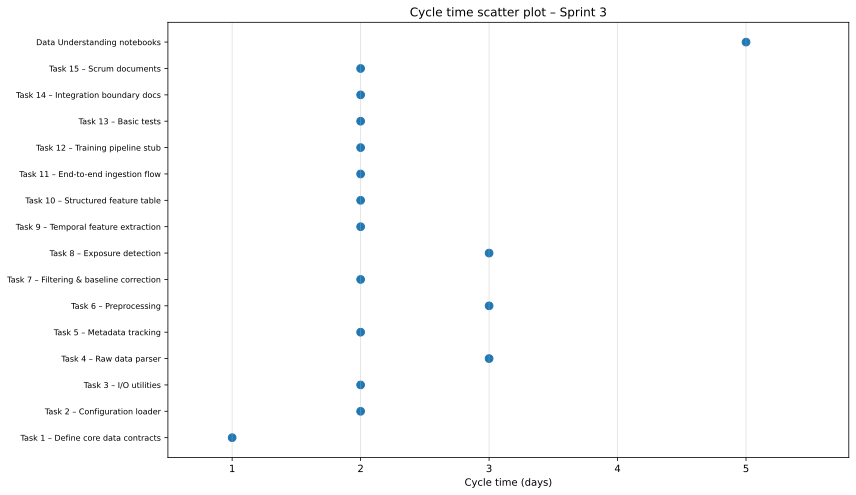
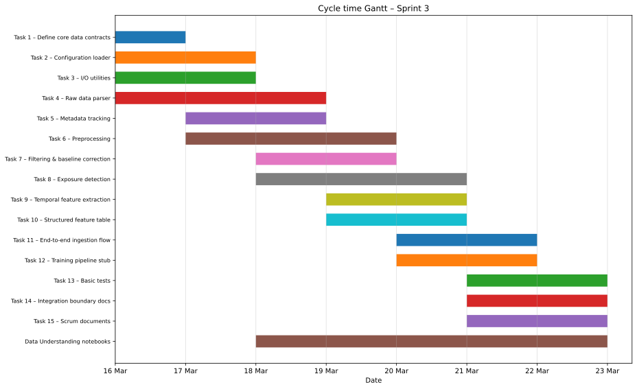

# Sprint Report – Sprint 3

## Sprint Goal

Establish a complete data pipeline foundation for the CMOS sensor dataset, including data parsing, preprocessing, feature engineering, and initial data understanding to enable downstream modelling.

---

## Sprint Duration

**16 March – 22 March 2026**

---

## Team Roles

- **Faezeh & Sepideh:** Data pipeline implementation, feature engineering, notebooks  
- **Adi:** Scrum master  

---

## Sprint Backlog & Progress

### Completed Tasks

- [x] Task 1 — Define core data contracts  
- [x] Task 2 — Configuration loader  
- [x] Task 3 — I/O utilities  
- [x] Task 4 — Raw data parser  
- [x] Task 5 — Metadata tracking  
- [x] Task 6 — Preprocessing  
- [x] Task 7 — Signal filtering & baseline correction  
- [x] Task 8 — Exposure detection  
- [x] Task 9 — Temporal feature extraction  
- [x] Task 10 — Structured feature table  
- [x] Task 11 — End-to-end ingestion flow  
- [x] Task 12 — Minimal training pipeline stub  
- [x] Task 13 — Basic tests for pipeline  
- [x] Task 14 — Toluene integration boundary documentation  
- [x] Task 15 — Scrum documents  
- [x] Data Understanding notebooks and documentation  

---

## Key Deliverables

### 1. End-to-End Data Pipeline
- Raw CMOS sensor data → structured dataset  
- Modular pipeline design:
  - Parser
  - Preprocessing
  - Feature Engineering
  - Storage layer  

---

### 2. Data Understanding

- Transformation of 32×32 sensor frames into 1024 features  
- Statistical analysis:
  - Mean, standard deviation  
  - Distribution analysis  
- Visualizations:
  - Histograms  
  - Heatmaps  
- Temporal analysis of signal behaviour  

---

### 3. Feature Engineering

- Frame-level features:
  - mean, std, max  
- Temporal features:
  - differences (Δ)
  - rolling statistics  
- Phase-based features:
  - baseline / exposure / recovery  

---

### 4. Data Quality Insights

- Presence of many **zero-valued frames** → requires cleaning  
- Signal saturation near **maximum values (~4091)**  
- Temporal patterns are more informative than spatial patterns  

---

## Sprint Metrics

### Cycle Time (Estimated)

| Task Group | Duration |
|-----------|---------|
| Core Pipeline | 3–4 days |
| Feature Engineering | 2–3 days |
| Integration | 1–2 days |
| Documentation | 1–2 days |

**Average Cycle Time:** ~2.5 days  
**Total Tasks Completed:** 16  
**Completion Rate:** 100%  

---

## Cycle Time Analysis

### Cycle Time Scatter Plot

This chart shows the distribution of cycle times across individual tasks. Most tasks were completed within 1–3 days, indicating a relatively stable workflow with no extreme outliers.

---

### Cycle Time Gantt Chart

The Gantt chart illustrates how tasks were distributed over the sprint timeline. It shows a clear progression from pipeline setup to feature engineering and final documentation, with some parallel work between team members.

