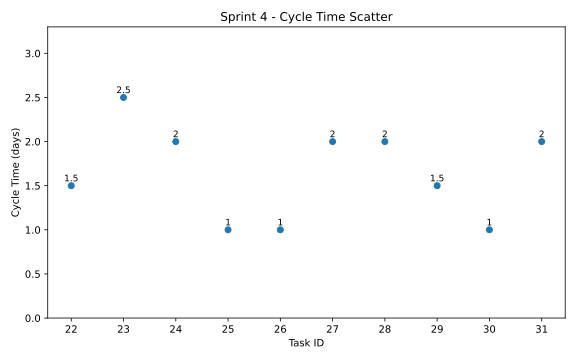
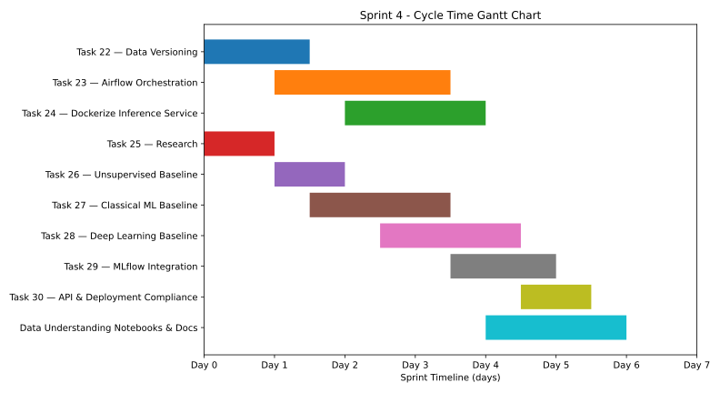

# Sprint Report – Sprint 4

## Sprint Goal

Extend the ML pipeline towards production readiness by implementing modelling approaches, experiment tracking, deployment components, and pipeline orchestration.

---

## Sprint Duration

**23 March – 29 March 2026**

---

## Team Roles

- **Faezeh & Sepideh:** Modelling, deployment, experimentation, pipeline extension  
- **Adi:** Scrum master  

---

## Sprint Backlog & Progress

### Completed Tasks

- [x] Task 22 — Implement Data Versioning  
- [x] Task 23 — Orchestrate ML Pipeline Using Airflow  
- [x] Task 24 — Dockerize ML Inference Service  
- [x] Task 25 — Research  
- [x] Task 26 — Add unsupervised baseline model  
- [x] Task 27 — Add classical ML baseline  
- [x] Task 28 — Add deep learning baseline  
- [x] Task 29 — Add MLflow  
- [x] Task 30 — API and Deployment Compliance  
- [x] Create data understanding notebooks and documents  

---

## Key Deliverables

### 1. Modelling Layer

- Implementation of multiple modelling approaches:
  - Unsupervised learning baseline  
  - Classical ML models (e.g., SVM, KNN)  
  - Deep learning baseline  

- Comparison of model performance:
  - Random split → higher accuracy (~optimistic)
  - Group-based split → poor generalization  

---

### 2. Experiment Tracking (MLflow)

- Experiment tracking  
- Model versioning  
- Metric logging  

---

### 3. Data Versioning

- Version control for datasets and processed data  
- Ensures reproducibility  

---

### 4. Pipeline Orchestration (Airflow)

- Automated pipeline execution  
- Clear workflow structure  

---

### 5. Deployment & Inference Service

- FastAPI `/predict` endpoint  
- Dockerized service  
- Portable deployment  

---

### 6. API & Deployment Compliance

- Standardized API  
- Consistent deployment behavior  

---

## Key Insights

- **Generalization problem across runs**
- **Data leakage identified (random split)**
- **Run variability > gas differences**

➡️ Need better features + more robust models

---

## Sprint Metrics

### Cycle Time (Estimated)

| Task Group | Duration |
|-----------|---------|
| Modelling | 3–4 days |
| MLflow | 1–2 days |
| Airflow | 1–2 days |
| Deployment | 1–2 days |
| Documentation | 1–2 days |

**Average Cycle Time:** ~2 days  
**Total Tasks Completed:** 10  
**Completion Rate:** 100%  

---

## Cycle Time Analysis

### Cycle Time Scatter Plot

This chart shows the distribution of task durations. Most tasks were completed within 1–3 days, indicating stable execution despite increased complexity.

---

### Cycle Time Gantt Chart

The Gantt chart illustrates the progression of work during the sprint, showing a shift from modelling to deployment and integration tasks.

---

## Sprint Summary

Sprint 4 moved the system from a **data pipeline** to a **production-ready ML pipeline**.

Key achievements:
- Full modelling stack
- Experiment tracking (MLflow)
- Orchestration (Airflow)
- Deployment (Docker + API)

Main challenge:
- Lack of generalization across runs