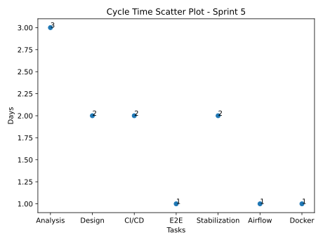
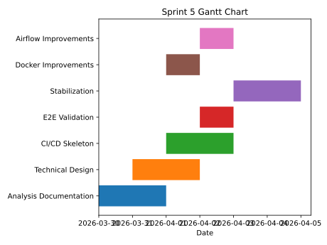

# Sprint Report – Sprint 5

## Sprint Goal

Strengthen the production readiness of the ML system by completing CI/CD setup, improving testing, finalizing documentation, and validating end-to-end pipeline execution.

---

## Sprint Duration

**30 March – 5 April 2026**

---

## Team Roles

- **Faezeh & Sepideh & Adi:** CI/CD, testing, documentation, pipeline validation  
- **Adi:** Scrum master  

---

## Sprint Backlog & Progress

### Completed Tasks

- [x] Task 20 — Technical Design Documentation  
- [x] Task 19 — Analysis Documentation  
- [x] Task 22 — Implement Data Versioning (final refinements)  
- [x] Task 23 — Orchestrate ML Pipeline Using Airflow (stabilization)  
- [x] Task 24 — Dockerize ML Inference Service (improvements)  
- [x] CI/CD Skeleton  
- [x] E2E Slice 1 for Pipeline  

---

### In Progress / To Do

- [ ] Unit Tests in CI  
- [ ] Documentation for CI/CD  

---

## Key Deliverables

### 1. Technical & Analysis Documentation

- Completed **Analysis Document**
  - Data understanding  
  - Feature engineering decisions  
  - Modeling challenges and limitations  

- Completed **Technical Design Document**
  - System architecture  
  - Tooling justification (Airflow, MLflow, FastAPI, DVC)  
  - Pipeline structure and deployment setup  

---

### 2. CI/CD Pipeline (Initial Setup)

- Created **CI/CD skeleton**
- Defined structure for:
  - Automated builds  
  - Pipeline execution checks  
  - Future test integration  

➡️ Foundation for full automation is now in place

---

### 3. End-to-End Pipeline Validation

- Implemented **E2E Slice 1**
  - ingestion → feature engineering → modeling → prediction  

- Ensures:
  - Full system integration  
  - Pipeline runs end-to-end  

---

### 4. System Stabilization

- Improved:
  - Airflow orchestration  
  - Docker inference service  
  - Data versioning consistency  

---

## Key Insights

- **System integration validated end-to-end**
- **CI/CD foundation ready but incomplete**
- **Testing is the main gap**

➡️ Next step: automated testing + CI/CD completion

---

## Sprint Metrics

### Cycle Time (Estimated)

| Task Group | Duration |
|-----------|---------|
| Documentation | 2–3 days |
| CI/CD Setup | 1–2 days |
| E2E Validation | 1–2 days |
| System Stabilization | 1–2 days |

**Average Cycle Time:** ~2 days  
**Total Tasks Completed:** 7  
**Completion Rate:** ~80–85%  

---

## Cycle Time Analysis

### Cycle Time Scatter Plot

This chart shows that most tasks were completed within **1–3 days**, indicating stable development and manageable complexity.

---

### Cycle Time Gantt Chart

The Gantt chart shows the progression of work during the sprint:
- Early sprint → documentation  
- Mid sprint → CI/CD and integration  
- Late sprint → stabilization and testing  

---

## Sprint Summary

Sprint 5 focused on **closing the gap between development and production readiness**.

Key achievements:
- Completed **analysis & design documentation**
- Established **CI/CD foundation**
- Validated **end-to-end pipeline execution**

Main challenge:
- **CI/CD not fully complete yet (testing pending)**